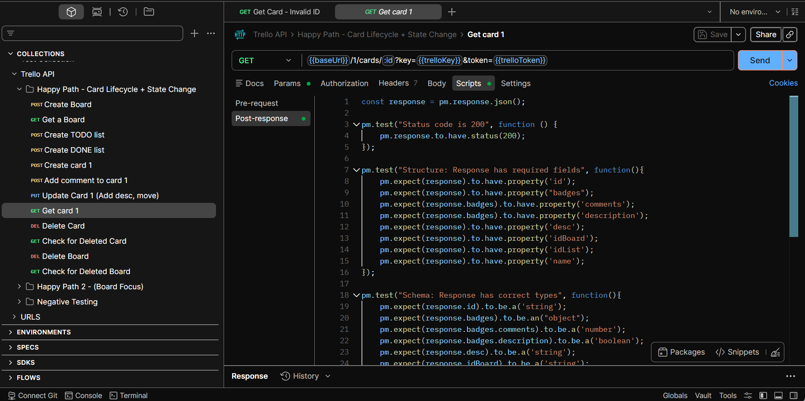
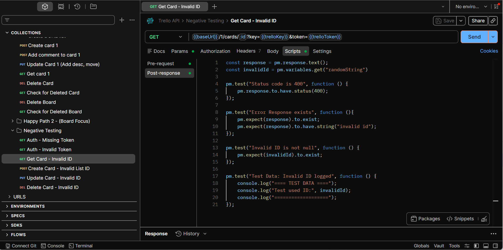
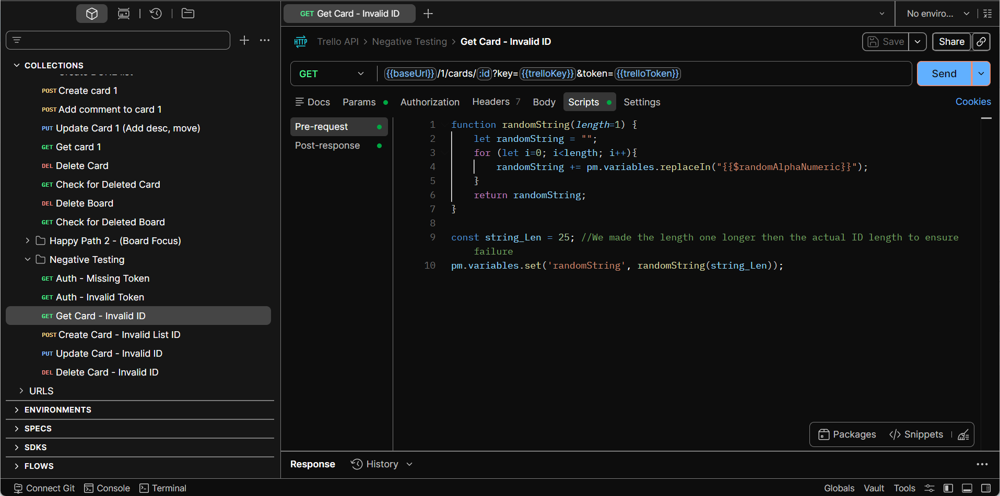
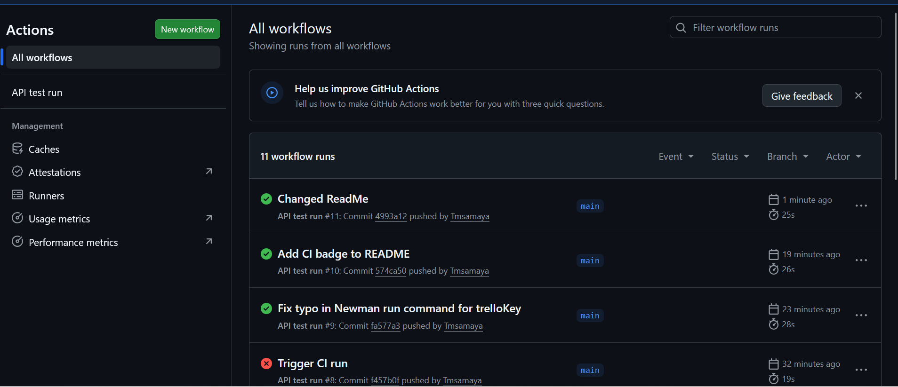
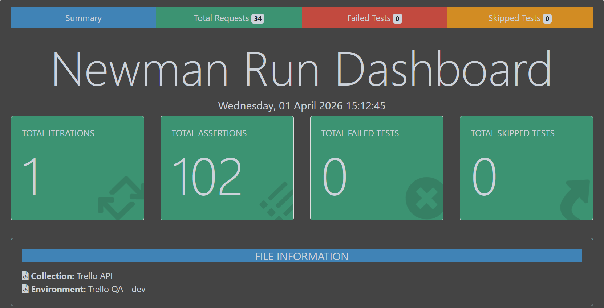
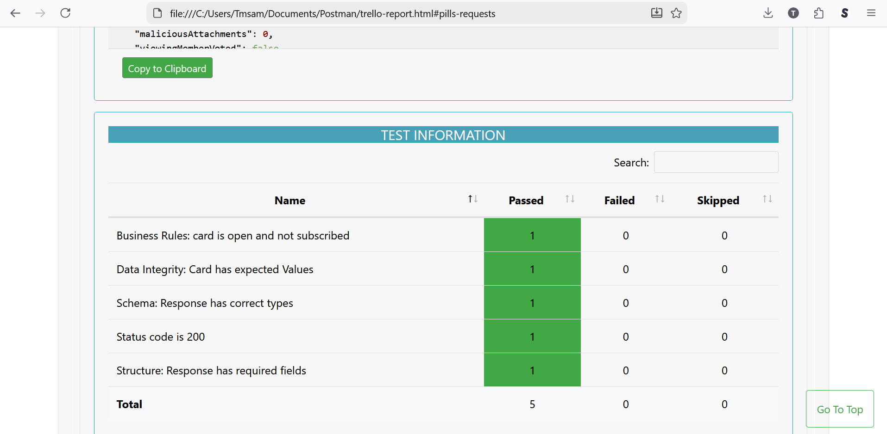

# 🧪 Trello API Test Automation Project

## 📌 Overview

This project is a comprehensive API testing suite built using **Postman** and executed via **Newman (CLI)**. It demonstrates end-to-end testing of Trello’s core functionality, including board and card management, with a strong focus on structured validation and real-world QA practices.


---

## 🚀 Key Features

* ✅ End-to-end **CRUD workflow testing**
* 🔁 **Dynamic variable chaining** across requests
* 🧪 Layered test validation strategy:

  * Structure validation
  * Schema validation
  * Data integrity checks
  * Business rule validation
* ❌ Robust **negative testing scenarios**
* ⚙️ CLI execution using **Newman**
* 📊 HTML reporting with **htmlextra reporter**

---

## 🔄 Test Workflow (Happy Path)

The primary workflow simulates a real user scenario:

1. Create Board
2. Create Lists (To Do / Done)
3. Create Card
4. Add Comment to Card
5. Update Card (description + move list)
6. Validate Card State
7. Delete Card
8. Confirm Card Deletion
9. Delete Board
10. Confirm Board Deletion

---

## ❌ Negative Testing Coverage

Includes scenarios such as:

* Missing / invalid API key
* Missing / invalid token
* Invalid resource IDs
* Missing required fields

These tests validate API robustness and proper error handling.

---

## 🧠 Test Strategy

Tests are structured in layered validation levels:

* **Structure**:
  Ensures required fields exist in the response.

* **Schema**:
  Validates data types and response shape.

* **Data Integrity**:
  Confirms returned values match expected inputs (e.g., variable chaining).

* **Business Rules**:
  Verifies functional behavior (e.g., card moves to correct list).

---

## 📸 Postman Execution (Visual Proof)

### ✅ Happy Path Workflow



### ❌ Negative Testing Examples

  

  
(Shows an example of generating data to mimic ID's)

---
---

## 🚀 CI/CD Integration – GitHub Actions + Newman

This project includes a **CI pipeline using GitHub Actions** to automatically execute API tests on every code change.

### 🔧 What It Does

* Triggers on every **push** and **pull request**
* Runs in a clean **Ubuntu environment**
* Installs **Node.js + Newman**
* Executes the full Postman collection via CLI
* Injects credentials securely using **GitHub Secrets**
* Generates **JUnit test reports** per run

---

### 🧪 Test Execution Flow

1. Repository is checked out in a fresh CI environment
2. Node.js is installed for CLI tooling
3. Newman is installed globally via npm
4. Postman collection is executed with runtime variables:
   * `trelloKey`
   * `trelloToken`
   * `baseUrl`
5. Results are evaluated:
   * ❌ Any failure → workflow fails
   * ✅ All tests pass → workflow succeeds
6. Test reports are generated and uploaded as artifacts


---

### 🔐 Secure Configuration

Sensitive credentials are **never stored in the repository**.

They are injected at runtime using GitHub Secrets:

```bash
--env-var "trelloKey=${{ secrets.TRELLO_KEY }}"
--env-var "trelloToken=${{ secrets.TRELLO_TOKEN }}"
```

## ⚙️ Running Tests with Newman

### Prerequisites

* Node.js installed
* Newman installed:

```bash
npm install -g newman
```

### Run Collection

```bash
newman run "Trello API.postman_collection.json" -e "Trello Environment.postman_environment.json"
```

### Run with HTML Report

```bash
newman run "Trello API.postman_collection.json" -e "Trello Environment.postman_environment.json" -r htmlextra --reporter-htmlextra-export report.html
```

---

## 📊 Newman HTML Report

The collection can be executed via CLI using Newman, generating a detailed HTML report:




---

## 🔐 Environment Configuration

This project uses environment variables for sensitive data:

* `trelloKey`
* `trelloToken`

⚠️ **Note:**
API credentials are not included. Replace placeholders in the environment file with your own values.

---

## 🛠️ Tech Stack

* Postman
* Newman
* GitHub Actions
* JavaScript (Postman scripting)
* Trello REST API

---

## 💡 Highlights

* Demonstrates real-world QA workflow design
* End-to-end API validation with layered testing
* Strong negative testing and edge case coverage
* CI/CD integration for automated test execution
* Secure credential management using GitHub Secrets

---

## 👤 Author

Tomas Amaya
QA Engineer (6+ years experience)

---
